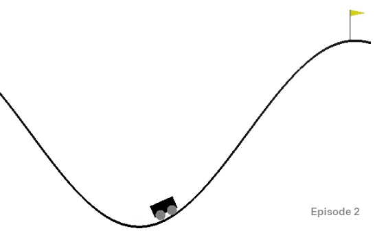

# MountainCar-with-TF-Agents

## Deep Reinforcement Learning with TF-Agents on MountainCar-v0 Environment



Environment : [OpenAI Gym](https://gym.openai.com/envs/MountainCar-v0/)

+ **Project summary**: 

Reinforcement learning (RL) is an area of machine learning concerned with action decision to maximize the notion of cumulative reward. Based on this, TF-Agents were first introduced in 2018 to implement decision making. This project will train a specific TF-Agent to fit the MountainCar-V0 Environment in OpenAI Gym environment, which use simple physics rules to solve classic controls problems. For this particular agent, it will automaticallt find the trick to push the car left or right, till it is equipped with enough power to climb the hill. Detailed training process and description videos will be provided to help explain this agent.

We are trying to solve MountainCar-v0 problem. In this specific control theory problem, a car is on a one-dimensional track, positioned between two "mountains". The goal is to make an under powered car to the top of a hill on the right side. The only admitted interference toward the car is to push it left or right with a fixed momentum. Thus, we use TF-Agents to implement reinforcement learning on the model to let a car drive back and forth automatically to reach the top of the hill.

```
proj/
├── doc/
├── fig/
└── output/
```

Please see each subfolder for a README file.
